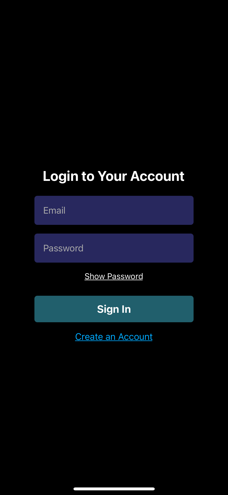
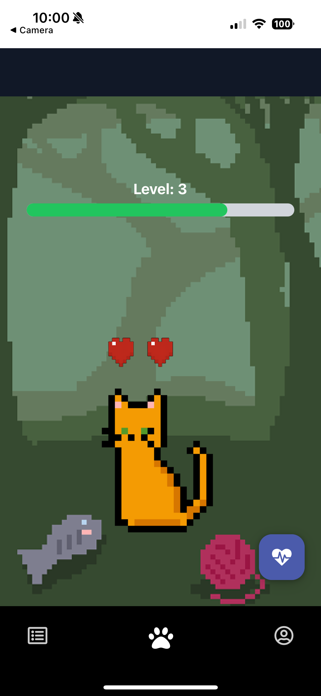
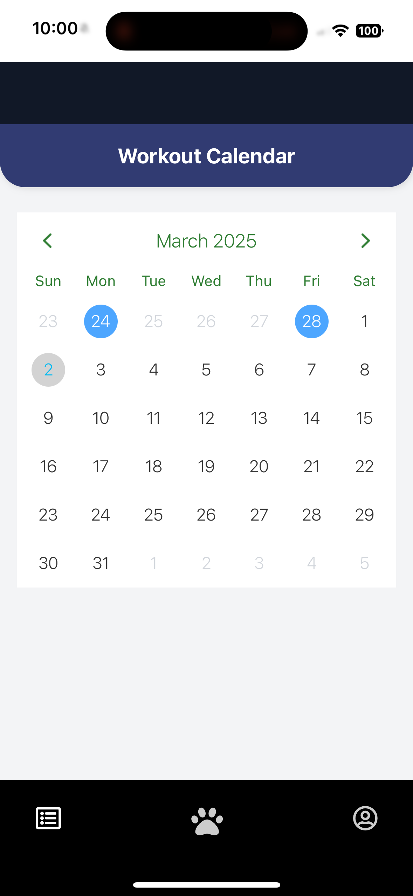
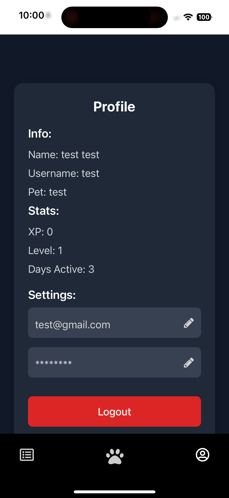

# **Fitagotchi** _by They See Cats_


### 1. Main Login Page

This is the main login screen where users can enter their credentials to access the app.



---

### 2. Pet Screen

After logging in, users can view their virtual cat and their user level.



---

### 3. Workout Log

Users can keep a track of their progress and mark which days of the calendar they worked out.



---

### 4. Profile Screen

The profile screen displays user information, their stats, and customization options.




## Inspiration

Going to the gym is key for improving your health and wellbeing, and while everyone knows that, most people struggle with sticking with it. Our app aims to motivate people to workout regularly and consistently. We were inspired by Duolingo, a language learning app, and Andante, and a music practicing app.

## What it does

The app lets you track your workout progress to progress and level up your Fitagotchi gym pet, by consistently maintaining your workouts, you can keep your friend happy!

## How we built it

Frontend: App was mainly built using React Native and Expo. Libraries such as Tailwind CSS was used to style. 
Backend: App mostly communicates with a Supabase project that handles user authentication and user related date such as workout sessions, user pets, etc.

## How to run the app

Note: You **do** need to have the Expo Go app installed on your phone to run the app. You can download it from the App Store or Google Play Store.

1. Clone the repository

```bash
git clone https://github.com/ayman2002rahman/Pickhacks-2025.git
```

2. Install the dependencies

```bash
# Create a virtual environment
python3 -m venv env
source env/bin/activate

# Install required dependencies
pip install -r requirements.txt

# Install required node modules
cd front-end/
npm install
```

3. Run the app

```bash
npm start
```

## Challenges we ran into

- Our scope initially was too large and we had to cut back on some features
- The git merge conflicts with multiple people trying to work on the same codebase at the same time

## Accomplishments that we're proud of

- Cute cat animations
- Successful logged workouts

## What we learned

We learned how to work together as a team and delegate tasks. For some of us, it was there first time with a frame work or tool.

## What's next for Fitagotchi

- implement specific exercise, # of sets and reps to improve xp grinding
- Implement a design system to ensure consistency across the app

## Contributors
---
## TEAM CONTRIBUTORS
-------------------------------------
|  Full Name       | Github Username |  Team|
|------------------|-----------------| ---------- 
|Pranav Mahesh     |   [pmahesh29](https://github.com/pmahesh29)     |Frontend & User Interface |
|Vishal Jeyam   |   [vjeyam](https://github.com/vjeyam)               |Database & Backend Development|
|Ayman Rahman   |   [ayman2002rahman](https://github.com/ayman2002rahman) | Frontend & User Interface  |
------------------------------------------------------------------------